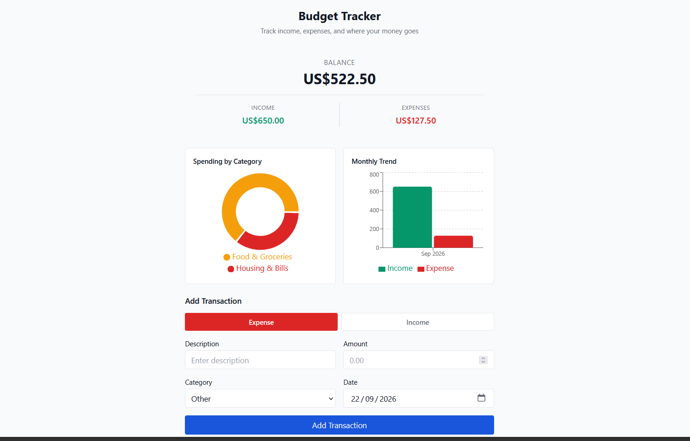

# Budget Tracker

A budget tracking application built with React, TypeScript, and Vite. Track income and expenses by category, see trends over time, and keep everything backed up as a CSV.



## Features

- **Track transactions** — add income or expenses with a category and date
- **Categories** — color-coded categories (Salary, Freelance, Food, Housing, etc.), filterable by type
- **Search, filter & sort** — find transactions by description, category, type, or sort by date/amount
- **Charts** — spending-by-category breakdown and a monthly income-vs-expense trend
- **CSV export/import** — back up your data or bring in transactions from elsewhere
- **Persistent storage** — data is saved in your browser via `localStorage`, with automatic migration from the original data format
- **Type-safe** — the whole app is written in TypeScript
- **Tested** — core filtering/sorting and CSV logic have unit tests
- **Accessible** — keyboard-navigable forms and controls, labeled inputs, live-region error messages

## Tech Stack

- **React 19** — UI library
- **TypeScript** — type safety across the app
- **Vite** — build tool and dev server
- **Zustand** — lightweight state management with built-in `localStorage` persistence
- **Recharts** — category and trend charts
- **date-fns** — date formatting and grouping
- **Vitest** — unit testing
- **oxlint** — fast linting

## Project Structure

```
src/
  components/       UI components (form, list, filters, charts, import/export)
  constants/        Category definitions
  lib/              Pure helper logic: filtering/sorting, CSV, formatting, migration
  store/            Zustand store for transactions
  App.tsx           Top-level layout and wiring
  main.tsx          Entry point
```

## Getting Started

```bash
npm install
npm run dev
```

Then open the URL Vite prints (usually `http://localhost:5173`).

## Scripts

- `npm run dev` — start the dev server
- `npm run build` — type-check and build for production
- `npm run preview` — preview the production build locally
- `npm run test` — run the unit test suite
- `npm run typecheck` — run TypeScript's type checker without emitting files
- `npm run lint` — run oxlint

## Data & Migration

Transactions are stored in `localStorage` under the key `budget-tracker-storage`. If you're upgrading from an earlier version of this app that stored a plain array under the `transactions` key, your existing data is automatically migrated the first time you load the new version — nothing is lost.

## CSV Format

Exported/imported CSVs use this format:

```
date,description,category,amount
2026-01-15,Salary,salary,1000
2026-01-01,"Coffee, large",food,-4.5
```

`amount` is signed: positive for income, negative for expenses. Unrecognized category IDs fall back to "Other" on import.
